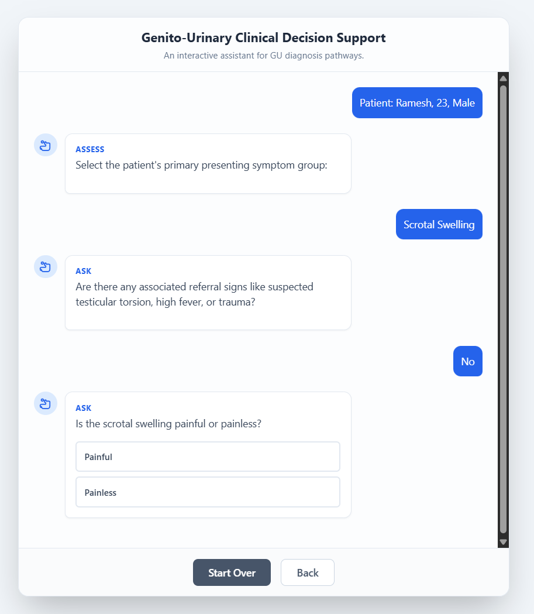

# 🩺 Genito-Urinary Clinical Decision Support System (CDSS)

> A logic-based AI-powered Clinical Decision Support System for **Genito-Urinary (GU) infections**,  
> designed to assist clinicians in structured diagnosis and reasoning using the **IKP-BTP Algorithm**  
> and a curated **Knowledge Bank (P-GU series)**.

---

## 🧭 Overview
This project demonstrates how a **Google AI Studio chatbot** can be adapted into a clinical reasoning assistant.  
The system guides the clinician through a structured diagnostic conversation — integrating patient demographics,  
symptom analysis, and decision locks — to arrive at probable GU infection diagnoses.  

It combines **modern AI logic** with **clinical examination principles**:  
**Ask → Inspect → Palpate → Lock → Listen → Check → Measure.**

---

## 🎯 Objectives
- To simulate **clinical reasoning** in Genito-Urinary disorders through AI-driven dialogue.  
- To build a **logic-based diagnostic flow** inspired by the **IKP-BTP Algorithm**.  
- To assist clinicians in stepwise **data collection and differential diagnosis**.  
- To demonstrate integration of **AI & healthcare domain knowledge** for education and decision support.  

---

## 🧩 Key Features
- 🧠 **Algorithmic reasoning** — integrates logic from the IKP-BTP diagnostic framework.  
- 👩‍⚕️ **Demographic stratification** — adapts diagnostic flow for male and female patients.  
- 🗂️ **Knowledge bank integration** — uses curated P-GU files for evidence-based responses.  
- 💬 **Interactive conversation flow** — guides user through structured clinical steps.  
- 📊 **Explainable output** — provides summarized findings and next-step suggestions.  

---

## ⚙️ Workflow Logic

| Step | Description |
|------|--------------|
| **Ask** | Gather history — symptoms, onset, pain, frequency, discharge, fever, etc. |
| **Inspect** | Observe external signs — swelling, redness, lesions. |
| **Palpate** | Identify tenderness, lumps, or local warmth. |
| **Lock** | Apply key decision locks to narrow differential diagnoses. |
| **Listen** | Include patient’s additional subjective concerns. |
| **Check** | Add investigation data — urine analysis, culture, USG. |
| **Measure** | Quantify parameters — urine output, temperature, WBC count. |

---

## 🧠 Knowledge Sources
- **P-GU-00x files** – Structured clinical insights for GU infections.  
- **IKP-BTP Algorithm** – Stepwise diagnostic reasoning model.  
- Standard clinical protocols and differential patterns for GU systems.  

---

## 🚀 Demo / How to Run
1. Open the project in [Google AI Studio](https://aistudio.google.com/).  
2. Upload the exported configuration file located at:
3. Run the chatbot interface.  
4. The system will begin by asking:
- Patient Name  
- Age  
- Gender  
- Duration of symptoms  
5. Then it continues through the structured examination flow (Ask → Inspect → Palpate → Lock → Listen → Check → Measure).  
6. At the end, it summarizes the probable diagnosis and recommends next steps.

---

## 💬 Example Interaction

**AI:** Please enter patient details — Name, Age, and Gender.  
**User:** Name: Ramesh, Age: 42, Gender: Male.  
**AI:** Thank you. What is the main urinary complaint — burning, frequency, discharge, or pain?  
**User:** Burning and increased frequency for 3 days.  
**AI:** Understood. Are there any associated symptoms like fever or flank pain?  
**User:** Mild fever, no flank pain.  
**AI:** Based on current findings, possible diagnoses include **Acute Cystitis** and **Urethritis**.  
Please confirm if there is any suprapubic tenderness.  

---

## 🗂️ Repository Structure

Genito-Urinary-CDSS/
│
├── prompts/
│ ├── main_prompt.txt # Core prompt and clinical logic
│ ├── logic_flow.txt # Ask → Inspect → Palpate → Lock → Listen → Check → Measure flow
│
├── knowledgebank/
│ ├── P-GU-001.txt
│ ├── P-GU-002.txt
│ └── ... # Knowledge base for GU conditions
│
├── docs/
│ ├── overview.pdf # Algorithm explanation or visual reference
│ ├── demo.png # Screenshot of AI Studio chatbot
│ └── references.txt # Literature or sources
│
├── app_config/
│ └── google_ai_studio_export.json # AI Studio export file
│
├── src/
│ ├── components/ # TypeScript components for UI logic
│ ├── constants/ # Config or variable definitions
│
├── README.md # Project documentation
└── LICENSE # Open-source license (MIT)

---

## 🧮 Tech Stack
- **Google AI Studio (Gemini)** — conversational model & prompt logic  
- **TypeScript + HTML** — frontend generated by AI Studio  
- **JSON Configuration** — defines model instructions and flows  
- *(Optional)* Python / Flask backend for future clinical integration  

---

## 🧪 Demo Preview

*(Sample interface from Google AI Studio — stepwise diagnostic reasoning flow.)*

---

## 🔭 Future Enhancements
- Integration with **Electronic Health Records (EHR)** or **FHIR** APIs  
- Add **Ayurvedic diagnostic mapping** (Prakriti and Dosha-based insights)  
- Train on additional datasets for multi-system decision support  
- Export logic as **FHIR-compatible decision rules** for hospital integration  

---

## 👨‍⚕️ Author
**Dr. Venkatesha Nayak**  
PG Diploma in AI & Data Science in Healthcare  
Junior Ayurvedic Physician | Data Science Enthusiast  

📍 Bengaluru, India  
📧 venkateshnayakb23@gmail.com 

---

## 📄 License
MIT License — Free to use and modify with attribution.  
See the [LICENSE](LICENSE) file for details.

---

## 🏷️ Topics
`ai-healthcare` • `cdss` • `genito-urinary` • `medical-ai` • `google-ai-studio` • `diagnostics` • `ayurveda`

---

### 🌟 Star this repo if you find it helpful or inspiring!
This project bridges **Ayurveda**, **clinical reasoning**, and **AI** — one logic step at a time.

---
_Last updated: November 2025_
